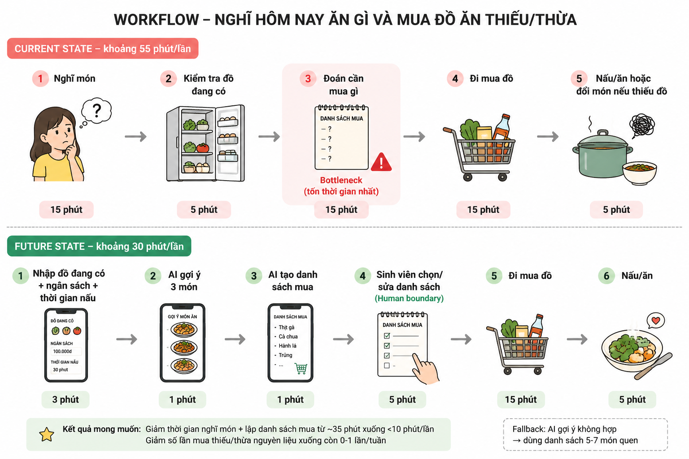

# 01 — Individual Problem Scan

## Scan rộng

Tôi scan 10 vấn đề đời thường quanh sinh viên ở trọ, vượt mức tối thiểu 5 vấn đề.

| # | Lăng kính | Problem quan sát được | Ai đang đau? | Dấu hiệu thật |
|---|---|---|---|---|
| 1 | Lặp lại | Mỗi ngày phải nghĩ hôm nay ăn gì rồi mua đồ theo cảm tính | Sinh viên ở trọ tự lo bữa ăn | Mất khoảng 20-30 phút/ngày để nghĩ món, dễ mua thiếu/thừa |
| 2 | Tốn thời gian | Đi siêu thị/cửa hàng nhưng không có danh sách rõ nên mua vòng vòng | Sinh viên tự nấu ăn | Mỗi lần mua đồ mất thêm 15-20 phút |
| 3 | Tốn thời gian | Theo dõi chi tiêu ăn uống bằng trí nhớ nên cuối tuần không biết tiền đi đâu | Sinh viên có ngân sách hạn chế | Hay vượt ngân sách nhưng không biết khoản nào nhiều nhất |
| 4 | Lặp lại | Quên đồ ăn trong tủ lạnh đến khi hỏng mới phát hiện | Sinh viên ở trọ, người sống một mình | Rau/thịt/trứng bị bỏ quên 1-2 lần/tuần |
| 5 | Pain từ người khác | Nhóm bạn muốn ăn chung nhưng mất thời gian thống nhất món | Nhóm 3-5 bạn | Phải nhắn qua lại nhiều lần trước mỗi bữa |
| 6 | AI có thể tốt hơn | Có nguyên liệu trong tủ nhưng không biết nấu món gì | Sinh viên mới tập nấu | Vẫn đặt đồ ăn ngoài dù còn đồ trong phòng |
| 7 | Tốn thời gian | Chọn quần áo đi học/đi làm thêm vào buổi sáng mất thời gian | Sinh viên bận buổi sáng | Mất 10-15 phút, đôi khi đi muộn |
| 8 | Lặp lại | Quên mang đồ cần thiết khi ra khỏi nhà như thẻ xe, sạc, tai nghe | Sinh viên đi học hằng ngày | Phải quay lại phòng hoặc mượn bạn |
| 9 | Pain từ người khác | Bạn cùng phòng không chia việc dọn phòng rõ ràng | Người ở ghép | Việc dọn dẹp bị dồn cho một người |
| 10 | AI có thể tốt hơn | Không biết ưu tiên việc cá nhân nào trước khi có nhiều deadline nhỏ | Sinh viên | Dễ làm việc dễ trước, để việc quan trọng sát hạn |

Vì sao phần scan này đủ tốt:

- Có nhiều lăng kính khác nhau, không chỉ quanh một app AI.
- Mỗi problem có actor cụ thể và dấu hiệu quan sát được.
- Các problem đều có workflow đời thường có thể vẽ được.
- Chưa nhảy thẳng sang solution hoặc agent.

## Top 3

| Rank | Problem | Vì sao chọn | Điều còn chưa chắc |
|---|---|---|---|
| 1 | Nghĩ hôm nay ăn gì và mua đồ ăn thiếu/thừa | Lặp lại nhiều lần/tuần, actor rõ, workflow rõ, đo được thời gian và số lần mua thiếu/thừa | Cần hỏi thêm vài bạn xem họ có đau giống mình không |
| 2 | Theo dõi chi tiêu ăn uống bằng trí nhớ | Impact tài chính rõ, có thể đo bằng số lần vượt ngân sách | Có thể chỉ cần app ghi chi tiêu hoặc Google Sheets, chưa chắc cần AI |
| 3 | Quên đồ ăn trong tủ lạnh đến khi hỏng | Có thể giảm lãng phí, workflow đơn giản | Cần biết người dùng có chịu nhập/chụp đồ ăn sau mỗi lần mua không |

## Problem Card #1 — Nghĩ hôm nay ăn gì và mua đồ ăn thiếu/thừa

**Problem 1 câu:**  
Sinh viên ở trọ mất thời gian nghĩ món ăn mỗi ngày, thường mua đồ theo cảm tính nên dễ thiếu nguyên liệu, thừa đồ ăn hoặc vượt ngân sách.

**Actor:**  
Sinh viên sống xa nhà, tự lo bữa ăn hằng ngày hoặc vài ngày trong tuần.

**Thời điểm / bối cảnh:**  
Buổi chiều/tối trước bữa ăn, hoặc trước khi đi siêu thị/cửa hàng tiện lợi.

**Current workflow:**

```text
1. Nghĩ hôm nay muốn ăn gì
2. Kiểm tra trong phòng/tủ lạnh còn gì
3. Tự đoán cần mua thêm gì
4. Đi mua đồ
5. Về nấu hoặc đổi món nếu thiếu nguyên liệu
6. Cất đồ thừa, đôi khi quên dùng tiếp
```

**Bottleneck:**  
Bước 1-3 — nghĩ món và lập danh sách mua đồ mất khoảng 25-40 phút/lần vì phải tự cân bằng khẩu vị, ngân sách, đồ đang có và thời gian nấu.

**Impact:**  
Mất thời gian trước mỗi bữa ăn, dễ mua thừa đồ tươi, dễ thiếu nguyên liệu, dễ đặt đồ ăn ngoài khi không nghĩ ra món. Chi tiêu ăn uống cũng khó kiểm soát hơn.

**Success metric:**  
Giảm thời gian nghĩ món + lập danh sách mua từ khoảng 35 phút xuống dưới 10 phút/lần; giảm số lần mua thiếu/thừa nguyên liệu xuống còn 0-1 lần/tuần.

**Non-AI alternative:**  
Lập thực đơn cố định 5-7 món quen và checklist mua đồ hằng tuần. Cách này đơn giản, ít rủi ro, nhưng dễ chán và không linh hoạt theo đồ đang có.

**AI hypothesis:**  
AI có thể gợi ý 3-5 món dựa trên đồ đang có, ngân sách, thời gian nấu và món không ăn. Sinh viên vẫn tự chọn món, tự kiểm tra giá và tự quyết định mua gì.

**Quick gut:**  
Workflow.

### Draft current workflow

```text
CURRENT STATE — khoảng 55 phút/lần

[1 Nghĩ món: 15']
→ [2 Kiểm tra đồ đang có: 5']
→ [3 Đoán cần mua gì: 15']  <-- bottleneck
→ [4 Đi mua đồ: 15']
→ [5 Nấu/ăn hoặc đổi món nếu thiếu đồ: 5']
```

### Draft future workflow

```text
FUTURE STATE — khoảng 30 phút/lần

[1 Nhập đồ đang có + ngân sách + thời gian nấu: 3']
→ [2 AI gợi ý 3 món: 1']
→ [3 AI tạo danh sách mua: 1']
→ [4 Sinh viên chọn/sửa danh sách: 5']  <-- human boundary
→ [5 Đi mua đồ: 15']
→ [6 Nấu/ăn: 5']

Fallback: AI gợi ý không hợp → dùng danh sách 5-7 món quen.
```

### Workflow card



## Problem Card #2 — Theo dõi chi tiêu ăn uống bằng trí nhớ

**Problem 1 câu:**  
Sinh viên thường mua đồ ăn, cà phê, đồ vặt nhiều lần trong tuần nhưng không ghi lại đều, đến cuối tuần không biết vì sao vượt ngân sách.

**Actor:**  
Sinh viên có ngân sách ăn uống giới hạn theo tuần hoặc theo tháng.

**Thời điểm / bối cảnh:**  
Sau mỗi lần mua đồ ăn, cuối ngày hoặc cuối tuần khi kiểm tra số tiền còn lại.

**Current workflow:**

```text
1. Mua đồ ăn/cà phê/đồ vặt
2. Trả tiền bằng tiền mặt hoặc chuyển khoản
3. Không ghi lại hoặc ghi rời rạc
4. Cuối tuần nhìn số dư tài khoản
5. Cố nhớ khoản nào đã tiêu nhiều
6. Tự ước lượng khoản cần giảm tuần sau
```

**Bottleneck:**  
Bước 3-5 — ghi và phân loại chi tiêu không đều, cuối tuần phải nhớ lại rất mơ hồ nên khó biết khoản nào làm vượt ngân sách.

**Impact:**  
Dễ vượt ngân sách, khó biết khoản nào nên giảm, tạo cảm giác mất kiểm soát tài chính cá nhân.

**Success metric:**  
Ghi được ít nhất 80% khoản ăn uống trong tuần; giảm số lần vượt ngân sách ăn uống từ khoảng 3 lần/tháng xuống 1 lần/tháng.

**Non-AI alternative:**  
Dùng app ghi chi tiêu hoặc Google Sheets với vài nhóm cố định như bữa chính, đồ uống, đồ vặt. Cách này đủ tốt nếu người dùng chịu nhập đều.

**AI hypothesis:**  
AI có thể phân loại chi tiêu từ mô tả ngắn hoặc ảnh hóa đơn, sau đó tóm tắt cuối tuần và gợi ý khoản nên giảm. Người dùng vẫn phải xác nhận số tiền và danh mục.

**Quick gut:**  
Rule / Workflow.

### Draft current workflow

```text
CURRENT STATE — cuối tuần khoảng 25 phút

[1 Mua nhiều khoản nhỏ trong tuần]
→ [2 Không ghi hoặc ghi rời rạc]
→ [3 Cuối tuần xem số dư: 5']
→ [4 Cố nhớ từng khoản: 15']  <-- bottleneck
→ [5 Ước lượng khoản cần giảm: 5']
```

### Draft future workflow

```text
FUTURE STATE — khoảng 5 phút/ngày

[1 Nhập nhanh khoản chi: 1']
→ [2 Rule phân nhóm theo danh mục: 1']
→ [3 AI tóm tắt cuối tuần: 2']
→ [4 Sinh viên tự chọn khoản cần giảm: 1']  <-- human boundary

Fallback: nếu không nhập đều, dùng Google Sheets/app ghi chi tiêu đơn giản.
```

## Problem Card #3 — Quên đồ ăn trong tủ lạnh đến khi hỏng

**Problem 1 câu:**  
Sinh viên mua đồ tươi như rau, trứng, thịt nhưng quên dùng, đến khi hỏng mới phát hiện và phải bỏ đi.

**Actor:**  
Sinh viên ở trọ có tủ lạnh riêng hoặc dùng chung tủ lạnh.

**Thời điểm / bối cảnh:**  
Sau khi đi chợ/siêu thị và cất đồ ăn vào tủ lạnh.

**Current workflow:**

```text
1. Mua đồ ăn
2. Cất vào tủ lạnh
3. Không ghi ngày mua hoặc hạn dùng
4. Vài ngày sau mua thêm đồ khác
5. Đồ cũ bị đẩy vào trong và bị quên
6. Phát hiện khi đồ đã hỏng
```

**Bottleneck:**  
Bước 3-5 — không có danh sách đồ đang có và không có nhắc dùng đồ tươi trước khi hỏng.

**Impact:**  
Lãng phí tiền, mất công dọn tủ lạnh, tạo cảm giác khó chịu vì mua đồ nhưng không dùng hết.

**Success metric:**  
Giảm số lần bỏ đồ ăn hỏng từ khoảng 2 lần/tuần xuống dưới 1 lần/tuần; dùng hết ít nhất 80% đồ tươi đã mua.

**Non-AI alternative:**  
Dán giấy note trên tủ lạnh hoặc dùng checklist "mua ngày nào, nên dùng trước ngày nào". Đây là cách đơn giản và có thể đủ nếu người dùng chịu cập nhật đều.

**AI hypothesis:**  
AI có thể gợi ý món dùng các nguyên liệu sắp hết hạn, nhưng người dùng vẫn phải nhập hoặc chụp lại đồ đang có trong tủ lạnh.

**Quick gut:**  
Rule + Workflow.

### Draft current workflow

```text
CURRENT STATE — lãng phí 1-2 món/tuần

[1 Mua đồ]
→ [2 Cất tủ lạnh]
→ [3 Không ghi ngày mua]
→ [4 Quên đồ cũ]  <-- bottleneck
→ [5 Phát hiện khi hỏng]
```

### Draft future workflow

```text
FUTURE STATE — giảm quên đồ tươi

[1 Nhập/chụp đồ vừa mua: 2']
→ [2 Rule nhắc dùng theo hạn 2-3 ngày]
→ [3 AI gợi ý món dùng đồ sắp hỏng]
→ [4 Sinh viên chọn món hoặc bỏ qua]  <-- human boundary

Fallback: nếu không muốn nhập/chụp đồ, dùng note dán tủ lạnh và checklist hạn dùng.
```
